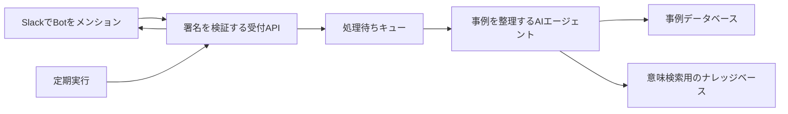

# 事例共有くん

事例共有くん（Jirei Share Bot）は、Slackの会話から社内の取り組み事例を登録し、検索と定期共有まで行うセルフホスト型のBotです。

利用者はBotをメンションして、普段の言葉で事例を登録・更新・検索できます。事例はAmazon DynamoDBに保存し、Amazon Bedrock Knowledge Basesで意味検索します。平日の昼など、指定した時刻に登録済みの事例をSlackへ再共有できます。

> [!WARNING]
> このリポジトリは初期公開版です。本番利用の前に、組織の情報区分、Slack Appの承認手続き、AWSの費用と権限を確認してください。

## 主な機能

- Botへのメンションから事例を登録・更新
- 同じSlackスレッドで不足情報を追加
- Amazon Bedrock Knowledge Basesによる意味検索
- Amazon EventBridge Schedulerによる定期共有
- メールアドレス、電話番号、トークンなどの投稿前検査

Google Driveからの資料取り込み、Slackメッセージ内のURL読み取り、公開Web検索、グラフィックレコーディング画像の生成は任意機能です。初期設定では無効です。

## 構成



詳しい構成は [docs/architecture.md](docs/architecture.md) にあります。

## 必要なもの

- Slack Appを作成・インストールできる権限
- AWSアカウント
- AWS CLI v2
- Node.js 24
- Python 3.12とuv（Python側のテストを実行する場合）
- Docker
- 利用するAmazon Bedrockモデルへのアクセス

既定リージョンは `ap-northeast-1`（東京）です。2026年8月13日時点で、[AgentCore Runtime](https://docs.aws.amazon.com/bedrock-agentcore/latest/devguide/agentcore-regions.html)、[S3 Vectors](https://docs.aws.amazon.com/AmazonS3/latest/userguide/s3-vectors-regions-quotas.html)、[Knowledge Basesで使う多言語埋め込みモデル](https://docs.aws.amazon.com/bedrock/latest/userguide/knowledge-base-supported.html)は東京リージョンに対応しています。利用する生成モデルの対応状況は変わるため、デプロイ前にAWSの公式情報とCLIで確認してください。

## セットアップ

### 1. 取得と依存関係のインストール

```sh
git clone <YOUR_REPOSITORY_URL>
cd jirei-share-bot
npm ci
```

### 2. Slackチャンネルを用意

事例の定期共有先となるパブリックチャンネルを作り、チャンネルIDを控えます。チャンネルIDはSlackのチャンネル詳細から確認できます。

### 3. CDKの設定

`cdk.json` の次の項目を変更します。

```json
{
  "region": "ap-northeast-1",
  "targetChannelId": "C0123456789",
  "bedrockModelId": "YOUR_BEDROCK_MODEL_OR_INFERENCE_PROFILE_ID"
}
```

任意機能は初期状態で無効です。使う場合は [docs/optional-integrations.md](docs/optional-integrations.md) を確認してください。

元メッセージへのリンクも保存したい場合は、`slackWorkspaceUrl` に `https://your-workspace.slack.com` の形式でSlackワークスペースURLを設定します。空欄のままでもBotは動作します。

### 4. AWSへデプロイ

操作対象のAWSアカウントを確認してからデプロイします。

```sh
aws sts get-caller-identity
npx cdk bootstrap
npm run build
npm test
npm run synth
npx cdk deploy --all
```

デプロイ後、CloudFormation outputの `SlackEventsEndpoint` を控えます。

### 5. Slack Appを作成

[config/slack-app-manifest.yaml](config/slack-app-manifest.yaml) の `request_url` を `SlackEventsEndpoint` に置き換え、SlackのApp ManifestからAppを作成します。

初期構成で要求するBot Token Scopeは次の3つです。

| Scope | 用途 |
|---|---|
| `app_mentions:read` | Botへのメンションを受け取る |
| `chat:write` | スレッド返信と定期共有を投稿する |
| `channels:history` | メンションされたスレッドの文脈を読む |

Event Subscriptionは `app_mention` だけです。DMとプライベートチャンネルは対象にしません。

### 6. Slackの認証情報を登録

Slack AppのSigning SecretとBot User OAuth TokenをAWS Systems Manager Parameter Storeへ保存します。

```sh
aws ssm put-parameter \
  --name /case-share-bot/slack/signing-secret \
  --type SecureString \
  --value '<SLACK_SIGNING_SECRET>' \
  --overwrite

aws ssm put-parameter \
  --name /case-share-bot/slack/bot-token \
  --type SecureString \
  --value '<SLACK_BOT_TOKEN>' \
  --overwrite
```

Botを定期共有先のチャンネルへ追加し、メンションして動作を確認します。

## 使い方

登録例：

> @事例共有くん コールセンターの問い合わせ分類を生成AIで補助しました。確認時間が1件15分から3分になりました。担当は業務改善チームの佐藤さんです。

検索例：

> @事例共有くん 問い合わせ対応を短縮した事例はありますか？

更新例：

> @事例共有くん この事例に「対象部署を2部門へ拡大した」と追記してください。

## データと安全性

- SlackのSigning SecretとBot TokenはParameter Storeの `SecureString` に保存します。
- Slackから受け取ったリクエストは署名と時刻を検証します。
- メールアドレス、電話番号、認証情報らしい文字列を検出した場合は伏せ字化または処理を停止します。
- Slackのraw messageは事例データとして保存しません。
- 公開Web検索などの外部連携は既定で無効です。

機械的な検査だけで、組織の機密情報を完全に判定することはできません。利用前に [docs/privacy-and-data-handling.md](docs/privacy-and-data-handling.md) を読み、保存してよい情報を組織内で決めてください。

## 開発

```sh
npm run build
npm test
npm run check:public
```

Python側のテストは、GitHub Actionsと同じロック済み依存関係で実行します。

```sh
uv run --with-requirements agentcore-runtime/requirements-dev.txt \
  pytest agentcore-runtime/tests/test_main_smoke.py
```

依存関係を更新するときは `requirements.in` と `requirements-dev.in` を編集し、`uv pip compile` でロックファイルを作り直します。

公開リポジトリを管理する方は、最初のリリース前に [GitHubリポジトリの推奨設定](docs/repository-settings.md) も確認してください。

## ライセンス

Apache License 2.0です。詳しくは [LICENSE](LICENSE) を確認してください。

Copyright 2026 KDDI Agile Development Center Corporation.
